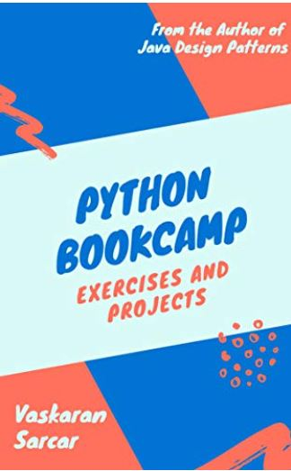

# Python Bookcamp Source Code

This repository accompanies [*Python Bookcamp*](https://www.amazon.com/Python-Bookcamp-Exercises-Hands-Projects-ebook/dp/B08FTD48NF/ref=sr_1_1?dchild=1&keywords=Python+Bookcamp%3A+Exercises+and+Hands-on+Projects&qid=1605020741&sr=8-1) by Vaskaran Sarcar (2020).

[comment]: #cover

Download the files as a zip using the green button, or clone the repository to your machine using Git.

## Releases

Release v1.0 corresponds to the code in the published book, without corrections or updates.

## Contributions

See the file Contributing.md for more information on how you can contribute to this repository.
